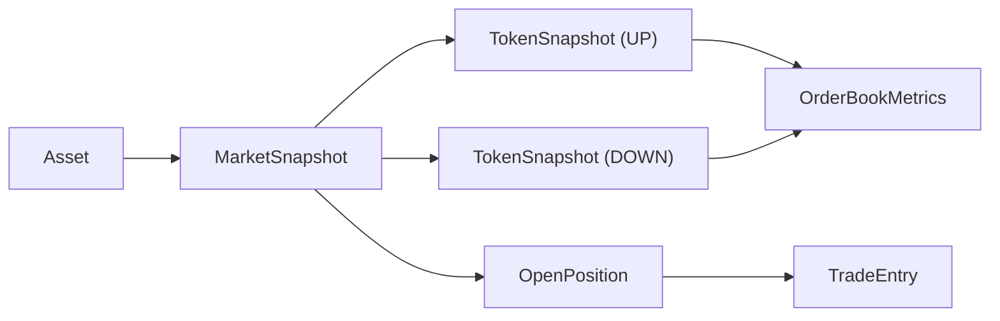

# Order Book Ontology

This bot now treats market microstructure as first-class state instead of a single entry filter.

## Core entities

- `Asset`
  - External price source and Polymarket slug prefixes for a tradable underlying such as BTC, ETH, DOGE, or XRP.
- `MarketSnapshot`
  - One active 5m or 15m Polymarket market window for an asset.
  - Owns both token views (`up`, `down`), the currently favoured side, and whether a paper trade was opened.
- `TokenSnapshot`
  - The state of one token inside a market window.
  - Carries the live midpoint plus the latest `OrderBookMetrics`.
- `OrderBookMetrics`
  - Best bid / ask, spread, top-level size, aggregated depth, and bid-side imbalance over the top `N` levels.
  - This is the ontology node that makes order books queryable and reusable outside the entry gate.
- `OpenPosition`
  - A live paper position with entry price, shares, expiry, and exit-management state.
- `TradeEntry`
  - The audit log record for a position lifecycle.

## Relationships

## Why this matters

- We can monitor all active books, not just the favoured token.
- Entry logic still uses the favoured-side imbalance, but the domain model now supports:
  - cross-market liquidity scans
  - spread monitoring
  - regime detection from book pressure
  - future ontology additions such as `OrderBookEvent`, `LiquidityShift`, or `MarketMicrostructureSignal`
